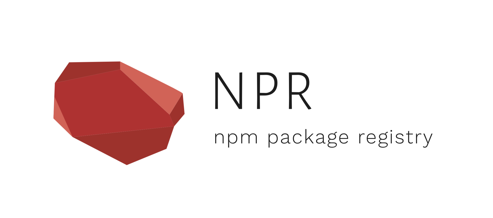

<div align="center">
   

  <h1>npm-package-registry</h1>

  <a href="https://hub.docker.com/r/pkgems/npm-package-registry/tags">
    
  </a>
  <a href="https://hub.docker.com/r/pkgems/npm-package-registry/builds">
    
  </a>
  <a href="https://github.com/pkgems/npm-package-registry/blob/master/license">
    
  </a>
</div>


<br />
<br />


## Introduction
NPR provides a minimal NPM-compatible package registry with support of multiple database and storage providers. NPR is designed to be small and fast, allowing for easy deployment to cloud. NPR is **not** a proxy registry, it doesn't support caching and redirecting requests to an upstream registry. If you require such functionality, consider using [npm-cache-proxy](https://github.com/pkgems/npm-cache-proxy) or [Verdaccio](https://github.com/verdaccio/verdaccio).

#### Supported features
- [x] Publish package
- [x] Install package
- [ ] Unpublish package
- [ ] Organizations
- [ ] Access control

#### Supported databases
Databases are used to store package metadata.

- [x] Memory
- [x] MongoDB

#### Supported storages
Storages are used to store package tarballs. 

- [x] Memory
- [x] MongoDB

Feel free to open an issue or provide a pull request if you need a support for any other feature, database or storage provider.


<br />
<br />


## Installation
Docker is the preferred way to use NPR.
```
docker run -p 8080:8080 pkgems/npm-package-registry
```

Alternatively, binaries of different platforms can be found on [Releases](./) section.


<br />
<br />


## Configuration
Configuration can be managed either by CLI flags or environment variables.

| Options              | Env                  | Default         | Description                           |
| -------------------- | -------------------- | --------------- | ------------------------------------- |
| `--listen <address>` | `NPR_LISTEN_ADDRESS` | `locahost:8080` | Address to listen                     |
| `--silent`           | `NPR_SILENT`         | `0`             | Disable logs                          |
| `--database <name>`  | `NPR_DATABASE`       | `memory`        | Database to use ([list](./Databases)) |
| `--storage <name>`   | `NPR_STORAGE`        | `memory`        | Storage to use  ([list](./Storages))  |


<br />
<br />


## Benchmarks
...


<br />
<br />


## License
[MIT](./license)
